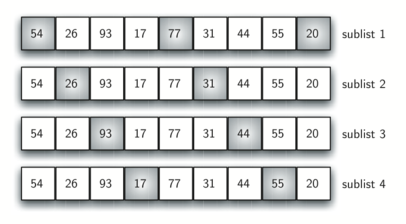

# 1. Bubble Sort Algorithm : 거품 정렬 알고리즘
## 1) 거품 정렬 알고리즘이란?
- 데이터의 각 인덱스를 처음부터 끝까지 거치면서 인접한 두 데이터를 비교하여, 큰 숫자를 맨 뒤로 보내는 정렬 방식
- 처음 검사한 데이터가 가장 큰 값이 되어 맨 뒤로 이동하고나면, 이 데이터를 제외한 나머지 데이터들을 인접한 두 가지를 순차적으로 비교하여 두 번째로 큰 수를 마지막 위치에 이동 시킨다.
- 이러한 방식으로 n-1 회를 검사하여 정렬한다.


## 2) 거품 정렬 알고리즘의 장점
- 코드가 비교적 단순하다.

## 3) 거품 정렬 알고리즘의 단점
- 하나의 데이터가 마지막으로 이동하기 위해서 모든 데이터와 비교를 거쳐야한다.
- 정렬의 순서에 맞지 않은 상태로 큰 값만을 마지막으로 보내기 때문에 데이터 처리 성능이 낮다.
- 교환(swap) 보다 이동(move) 을 사용하기 때문에 정렬 과정이 복잡하다.

## 4) python 의 교환 swap
- 두 데이터를 비교하고, 어떤 조건에 따라서 두 데이터를 교환하는 경우 python 에서는 다음과 같은 원리로 이루어진다.
- 먼저 i 와 j 번째 데이터를 비교하고, 두 데이터의 자리를 교환 swap 할 경우
```
① i 번째 데이터를 temp 등 임시 저장소에 저장한다. (temp = list[i])
② 리스트의 i 번째 저장소에  리스트의 j 번째 데이터값을  저장한다. (list[i] = list[j)]
③ 마지막으로 리스트의 j 번째 저장소에 원래 i 번째에 해당한 temp 데이터를 저장한다. 
```


## 5) 코드

- 거품 정렬 알고리즘
```
compare_counter = 0
swap_counter = 0

def bubble_sort(random_list) :
    global compare_counter, swap_counter

    for start_index in range(len(random_list)) :
        for index in range(1, len(random_list) - start_index) :  ### 마지막 인덱스가 하나씩 줄어든다.
            compare_counter += 1
            if random_list[index-1] > random_list[index] :       ### 앞의 숫자와 뒤의 숫자 비교
                swap_counter += 1
                temp = random_list[index-1]                      ### 앞의 숫자가 큰 경우 swap 원리를 이용하여 교환한다.
                random_list[index-1] = random_list[index]
                random_list[index] = temp
```

- 랜덤으로 숫자 데이터 생성
``
import random 

alist = []
input_num = input("데이터수 : ")
for x in range(int(input_num)) :
    alist.append(random.randint(1, int(input_num)))
```

- 결과 출력
```
import time

print("======== 정렬 전")
print(alist)
start_time = time.time()
bubble_sort(alist)
run_time = time.time() - start_time
print("======== 정렬 후")
print(alist)
print("======== 요약")
print("정렬시간 : ", run_time)
print("비교횟수 : ", compare_counter)
print("교환횟수 : ", swap_counter)
```
```
======== 정렬 전
[15, 80, 67, 20, 33, 31, 30, 66, 12, 12, 33, 56, 24, 99, 90, 3, 91, 67, 34, 96, 68, 27, 83, 18, 6, 6, 30, 67, 60, 58, 85, 3, 84, 69, 27, 10, 85, 9, 53, 52, 99, 12, 99, 17, 88, 2, 47, 33, 78, 62, 26, 4, 57, 11, 18, 63, 69, 44, 45, 13, 19, 18, 61, 65, 29, 23, 7, 55, 59, 57, 5, 99, 29, 8, 15, 56, 27, 20, 63, 21, 21, 54, 11, 39, 11, 64, 29, 74, 23, 25, 12, 31, 30, 99, 12, 28, 99, 61, 19, 89]
======== 정렬 후
[2, 3, 3, 4, 5, 6, 6, 7, 8, 9, 10, 11, 11, 11, 12, 12, 12, 12, 12, 13, 15, 15, 17, 18, 18, 18, 19, 19, 20, 20, 21, 21, 23, 23, 24, 25, 26, 27, 27, 27, 28, 29, 29, 29, 30, 30, 30, 31, 31, 33, 33, 33, 34, 39, 44, 45, 47, 52, 53, 54, 55, 56, 56, 57, 57, 58, 59, 60, 61, 61, 62, 63, 63, 64, 65, 66, 67, 67, 67, 68, 69, 69, 74, 78, 80, 83, 84, 85, 85, 88, 89, 90, 91, 96, 99, 99, 99, 99, 99, 99]
======== 요약
정렬시간 :  0.0009953975677490234
비교횟수 :  4950
교환횟수 :  2576
```

## 5)-1 다른 코드의 예
- pythonds 의 좀 더 간단한 코드

```
def bubbleSort(alist) :
    for passnum in range(len(alist)-1, 0, -1) :   ### passnum : 9,8,7,.,,2,1 
        for i in range(passnum) :                 ### passnum 이 줄어들때마다 i 에 저장되는 값의 범위가 줄어든다. 
	    if alist[i] > alist[i+1] :
	        temp = alist[i]                   ### 조건에 맞다면, swap 방식으로 교환한다.
		alist[i] = alist[i+1]
		alist[i+1] = temp
	    
```

## 6) 버블 정렬의 단점을 보완한 short bubble sort!!
- 버블 정렬 알고리즘의 단점은 몇 번의 정렬과정에서 정렬이 끝난 경우에도 각 데이터를 비교하는 실행을 지속한다.
- 즉 모든 큰 숫자가 뒤에서부터 차례대로 정렬되어 0 번째 숫자만 남을 때까지 이 작업을 실행하는 단점이 있다.
- 이러한 단점을 보완하기 위해, 정렬이 완료되면 더이상 비교를 하지 않고 검사를 종료 시키는 코드가 있다.
- shorbubble sort 라고 한다.

```
def shortBubbleSort(alist) :
    exchanges = True                     ### 교환 실행 여부의 값을 저장하는 변수 선언
    passnum = len(alist) -1              ### passnum : 전체 데이터 길이보다 1작음, 전체 인덱스
    while passnum > 0 and exchanges :    ### exchanges 가 True 이면 하위 코드 실행.
       exchanges = False                 ### while 문의 첫번째 조건을 통과하면 exchanges 를 False 로 저장
       for i in range(passnum)           ### i : 0,1,2,3...,7
           if alist[i] > alist[i+1] :    ### i 번째와 i+1 번째 비교
	        exchanges = True         ### if 조건문 통과하면, exchanges 를 True 로 저장
		temp = alist[i]          ### i 번째 데이터가 i+1 번째 데이터 보다 크면 swap
		alist[i] = alist[i+1]   
		alist[i+1] = temp
       
       passnum = passnum -1
```

```
alist=[20,30,40,90,50,60,70,80,100,110]
shortBubbleSort(alist)
print(alist)
```

- 위의 데이터에서 처음 정렬단계에서 90 이 7 번째 자리로 교환 되고,
- 다음 검사에서 전체 데이터를 비교하는데 for 문 아래의 if 문을 통과하지 않으므로 exchanges 가 False 로 남게된다.
- 3 번째 검사의 턴에서 while 문의 조건 exchanges = True 가 성립하지 않아 검사가 종료된다.

`
# 2. Shell Sort Algorithm : 쉘 정렬 알고리즘

## 1) 쉘 정렬 알고리즘이란?
- 전체 리스트를 몇 개의 부분리스트로 나누고 각 부분리스트의 각 위치에 상응하는 값끼리 비교하여 정렬한 후, 다음 검사에서는 더 작은 수의 부분리스트로 나누어 같은 방식으로 각 부분리스트의 위치에 상응하는 값끼리 비교하여 정렬한다.
- 이 때 부분리스트를 나누는 기준을 간격(gap) 이라고하고, gap 이 1이 될때까지 실행된다.
- gap 에 의해 부분리스트가 생성되면, 각 위치에 상응하는 데이터끼리는 삽입정렬 알고리즘의 원리로 정렬된다.
- 첫번째 검사에서 부분리스트를 3개를 만들었다면, 그 다음 검사에서는 더 좁은 간격의 부분리스트 6개를 만들어 비교한다. 그 다음 검사에서는 더 좁은 간격으로 부분리스트를 생성한다.




## 2) 쉘 정렬 알고리즘의 장점 
- 삽입 정렬 알고리즘의 단점을 보완한 방식으로, 인접하지 않은 데이터의 비교후 교환시 큰 거리를 이동해야하지만, 쉘 정렬 알고리즘은 부분리스트 상에서 해당하는 위치끼리 비교-교환하므로 상대적으로 큰 값이 제 위치에 있을 확률이 높다.

## 3) 코드

- 쉘 정렬 알고리즘

```
compare_counter = 0
swap_counter = 0

def shell_sort(num_list) :
    global compare_counter, swap_counter
    h = 1
    while h < len(num_list) :
        h = h * 3 + 1  
    h = h // 3   ### 데이터를 3등분 하기 위한 gap 
    
    while h > 0 :
        for i in range(h) :
            s_index = i + h   ### 나누어진 부분데이터의 인덱스 40, 41, 42,...,79
            
            while s_index < len(num_list) :
                temp = num_list[s_index]
                insert_index = s_index
                compare_counter += 1
                
		### 부분리스트의 각 위치별 값을 비교.
		### 0과 40 비교 후, 0이 40보다 작으면, 80과 비교한다.
                while insert_index > (h-1) and num_list[insert_index - h] > temp : 
                    swap_counter += 1
                    num_list[insert_index] = num_list[insert_index - h]
                    insert_index = insert_index - h
                
                num_list[insert_index] = temp
                s_index = s_index + h
            
        h = h // 3    ### 첫번째 검사가 끝나면, 3부분으로 나누어진 각각의 부분 데이터를 추가로 3등분 한다.
```

- 랜덤 데이터 생성

```
import random

alist = []
input_num = input("데이터수 : ")
for x in range(int(input_num)) :
    alist.append(random.randint(1, int(input_num)))
```

- 결과 출력

```
import time

print("======== 정렬 전")
print(alist)
start_time = time.time()
shell_sort(alist)
run_time = time.time() - start_time
print("======== 정렬 후")
print(alist)
print("======== 요약")
print("정렬시간 : ", run_time)
print("비교횟수 : ", compare_counter)
print("교환횟수 : ", swap_counter)
```

```
======== 정렬 전
[52, 21, 15, 79, 90, 81, 76, 33, 51, 13, 16, 31, 28, 38, 12, 6, 53, 8, 53, 89, 54, 20, 88, 14, 93, 51, 63, 45, 28, 70, 39, 64, 4, 63, 89, 38, 63, 8, 74, 35, 19, 58, 13, 21, 35, 11, 20, 16, 61, 99, 22, 6, 59, 83, 68, 27, 63, 67, 14, 44, 41, 57, 46, 24, 76, 78, 90, 76, 84, 62, 49, 73, 10, 41, 59, 77, 71, 24, 54, 95, 59, 52, 95, 98, 79, 82, 53, 66, 51, 85, 8, 35, 94, 99, 9, 34, 40, 72, 27, 30]
======== 정렬 후
[4, 6, 6, 8, 8, 8, 9, 10, 11, 12, 13, 13, 14, 14, 15, 16, 16, 19, 20, 20, 21, 21, 22, 24, 24, 27, 27, 28, 28, 30, 31, 33, 34, 35, 35, 35, 38, 38, 39, 40, 41, 41, 44, 45, 46, 49, 51, 51, 51, 52, 52, 53, 53, 53, 54, 54, 57, 58, 59, 59, 59, 61, 62, 63, 63, 63, 63, 64, 66, 67, 68, 70, 71, 72, 73, 74, 76, 76, 76, 77, 78, 79, 79, 81, 82, 83, 84, 85, 88, 89, 89, 90, 90, 93, 94, 95, 95, 98, 99, 99]
======== 요약
정렬시간 :  0.0009970664978027344
비교횟수 :  342
교환횟수 :  457
```

## 4) 다른 코드의 예
- 데이터를 부분리스트로 나누는 함수와 나누어진 부분리스트들의 데이터를 비교-교환하는 함수로 만들었다.

```
def shellsort(alist) :
    sublistcount = len(alist) // 2
    while sublistcount > 0 :
        for startposition in range(sublistcount) :
            gapinsertionSort(alist, startposition, sublistcount)
            
        # print("After increments of size", sublistcount, "The list is", alist)
        
        sublistcount = sublistcount // 2
        
compare_counter = 0
swap_counter = 0

def gapinsertionSort(alist, start, gap) :
    global compare_counter, swap_counter
    for i in range(start+gap, len(alist), gap) :
        currentvalue = alist[i]
        position = i
        compare_counter += 1
        while position >= gap and alist[position-gap] > currentvalue :
            swap_counter += 1
            alist[position] = alist[position-gap]
            position = position-gap
            
        alist[position] = currentvalue
```

- 결과 출력

```
import time

print("======== 정렬 전")
print(alist)
start_time = time.time()
shellsort(alist)
run_time = time.time() - start_time
print("======== 정렬 후")
print(alist)
print("======== 요약")
print("정렬시간 : ", run_time)
print("비교횟수 : ", compare_counter)
print("교환횟수 : ", swap_counter)
```

```
======== 정렬 전
[80, 13, 23, 85, 23, 12, 7, 61, 18, 97, 18, 43, 43, 84, 67, 72, 18, 37, 29, 24, 5, 95, 87, 66, 97, 94, 73, 6, 59, 39, 16, 75, 33, 93, 83, 78, 75, 34, 69, 83, 89, 78, 83, 22, 63, 28, 12, 16, 66, 93, 9, 44, 28, 68, 29, 94, 72, 79, 56, 30, 69, 97, 2, 50, 62, 87, 93, 65, 46, 31, 31, 26, 94, 86, 9, 79, 59, 75, 98, 18, 28, 19, 13, 85, 78, 2, 28, 69, 9, 82, 97, 95, 33, 10, 86, 48, 88, 87, 73, 14]
======== 정렬 후
[2, 2, 5, 6, 7, 9, 9, 9, 10, 12, 12, 13, 13, 14, 16, 16, 18, 18, 18, 18, 19, 22, 23, 23, 24, 26, 28, 28, 28, 28, 29, 29, 30, 31, 31, 33, 33, 34, 37, 39, 43, 43, 44, 46, 48, 50, 56, 59, 59, 61, 62, 63, 65, 66, 66, 67, 68, 69, 69, 69, 72, 72, 73, 73, 75, 75, 75, 78, 78, 78, 79, 79, 80, 82, 83, 83, 83, 84, 85, 85, 86, 86, 87, 87, 87, 88, 89, 93, 93, 93, 94, 94, 94, 95, 95, 97, 97, 97, 97, 98]
======== 요약
정렬시간 :  0.0
비교횟수 :  503
교환횟수 :  494
```

## 참고 사이트
https://gmlwjd9405.github.io/2018/05/08/algorithm-shell-sort.html
https://ratsgo.github.io/data%20structure&algorithm/2017/11/07/shellsort/
https://runestone.academy/runestone/books/published/pythonds/SortSearch/TheShellSort.html

