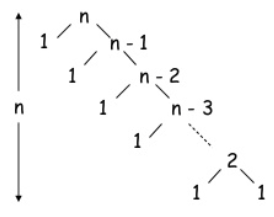
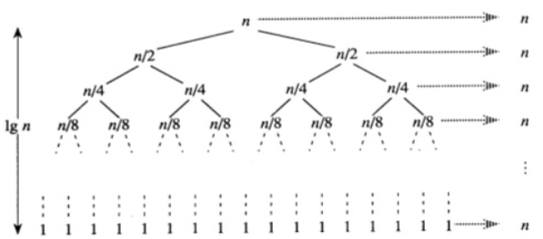

# 1. Quick Sort Algorithm : 퀵 정렬 알고리즘

## 1) 퀵 정렬 알고리즘이란?
- 분할 정복 (divide and conquer) 방법의 정렬 알고리즘이다.
    - 분할(divide) : 기준 데이터인 pivot을 정하고, pivot 을 기준으로 비균등하게 2개의 부분 배열로 분할한다. 
    - 정복(conquer) : 부분 배열을 정렬한다. 부분 배열을 재귀 호출을 통해서 다시 분할하며, 더이상 분할이 안될 때까지 반복한다. 
    - 결합(combine) : 정렬 된 부분배열들을 하나의 배열로 결합한다.
- 정렬 과정
    - 정렬할 데이터의 기준이 되는 데이터를 정하고 pivot 이라고 한다.
    - pivot을 중심으로 왼쪽 부분과 오른쪽 부분으로 나눈다. 
    - 왼쪽 부분의 첫번째 데이터와 오른쪽 부분의 마지막 데이터를 정의한뒤, 기준 데이터와 각 부분의 데이터들을 비교하여 기준 데이터보다 작으면 왼쪽으로 이동, 기준 데이터보다 크면 오른쪽으로 이동시킨다.
    - 첫번째 시행 후, 분할된 왼쪽 부분리스트와 오른쪽 부분리스트 각각 다시 기준 데이터를 정하고 같은 방식으로 데이터를 비교하여 정렬하는 방식이다.
    - 부분 리스트가 더 이상 분할이 안 될때가지 반복한다.
    


## 2) 퀵 정렬 알고리즘의 장점
- 퀵 정렬 알고리즘은 반복문을 1번 사용하고, 재귀 호출을 사용하기 때문에 정렬 속도가 빠르다. 
    ```
    - O(N*logN)
    ```
	
	
- 다른 정렬 알고리즘이 데이터의 교환을 위해서 임시 저장 공간을 할당하는 것에 비해서 퀵 정렬 알고리즘은 정렬하는 과정에서 임시 메모리를 사용하지 않기때문에 공간의 효율성이 좋다.

## 3) 퀵 정렬 알고리즘의 단점
- 퀵 정렬 알고리즘은 일반적인 데이터이 정렬에서 빠른 속도가 장점이지만, 이미 정렬이 되어있는 데이터나, 역으로 정렬이 되어 있는 데이터를 정렬하는 경우에는 속도가 느려지는 단점이 있다. 
    ```
    - O(N^2)
    ```


## 보충 설명
- 배열의 첫번쨰 혹은 마지막 데이터를 기준으로 잡고, 기준데이터를 제외한 배열의 양쪽 끝 데이터를 왼쪽마크, 오른쪽 마크로 설정한다. 왼쪽, 오른쪽 마크 데이터를 기준데이터와 비교한다. 
- 비교시에 각각의 조건을 따라야한다. 왼쪽마크 데이터는 기준데이터보다 작은 것, 오른쪽마크 데이터는 기준데이터보다 큰 것만 그대로 위치한다. 이 조건을 성리하면 왼쪽, 오른쪽 마크 데이터의 위치에서 한칸씩 이동한다.
- 비교시에 각각의 조건을 만족하지 않으면, 왼쪽마크 데이터와 오른쪽 마크데이터를 교환한다. 
- 왼쪽마크데이터와 오른쪽마크데이터의 위치가 바뀌는 지점에서 오른쪽 마크데이터의 위치를 기준점으로 삼고 위의 과정을 반복한다.
- 오른쪽 마크데이터를 반환받아서 새로운 기준점으로 정하고, 함수의 재귀호출을 통하여 기준점의 양쪽 부분을 다시 위의 과정을 반복한다.
- 이때에도 한쪽 부분의 첫번쨰 혹은 마지막 데이터를 기준점으로 삼고 왼쪽 마크데이터와 오른쪽 마크데이터를 지정하여 비교, 교환, 이동을 진행한다.

## 4) 퀵 정렬 알고리즘 코드
```
import random
import time

compare_counter = 0
swap_counter = 0

def swap(x, i, j) :
    global swap_counter
    swap_counter += 1
    x[i], x[j] = x[j], x[i]

def pivotFirst(x, lmark, rmark) :
    global compare_counter
    pivot_val = x[lmark]
    pivot_idx = lmark
    while lmark <= rmark :
        compare_counter += 1
        while lmark <= rmark and x[lmark] <= pivot_val :
            lmark += 1
        compare_counter += 1
        while lmark <= rmark and x[rmark] >= pivot_val :
            rmark -= 1
        if lmark <= rmark :
            swap(x, lmark, rmark)
            lmark += 1
            rmark -= 1
    swap(x, pivot_idx, rmark)
    return rmark

def quickSort(x, pivotMethod=pivotFirst) :
    def _qsort(x, first, last) :
        if first < last :
            splitpoint = pivotMethod(x, first, last)
            _qsort(x, first, splitpoint-1)
            _qsort(x, splitpoint+1, last)
    _qsort(x, 0, len(x) -1)
```
- 출력
```
lst = []
input_n = input("data : ")
for i in range(int(input_n)) :
    lst.append(random.randint(1, int(input_n)))

print("===== befor sort")
print(lst)

start = time.time()
quickSort(lst)
running = time.time() - start

print("===== after sort")
print(lst)
print("===== running time")
print(running)
print("===== compare_counter")
print(compare_counter)
print("===== swap_counter")
print(swap_counter)
```
```
data : 100
===== befor sort
[62, 54, 91, 84, 77, 49, 68, 40, 73, 69, 79, 72, 51, 56, 11, 93, 35, 57, 40, 84, 80, 82, 44, 74, 96, 47, 81, 83, 38, 67, 82, 18, 29, 74, 51, 47, 98, 19, 36, 71, 17, 100, 27, 83, 89, 39, 47, 11, 23, 82, 64, 71, 61, 6, 54, 69, 41, 56, 25, 38, 50, 64, 15, 67, 24, 49, 7, 83, 82, 8, 95, 40, 5, 25, 51, 73, 86, 33, 32, 42, 5, 84, 93, 96, 89, 82, 8, 23, 49, 68, 25, 98, 35, 69, 51, 78, 21, 95, 30, 86]
===== after sort
[5, 5, 6, 7, 8, 8, 11, 11, 15, 17, 18, 19, 21, 23, 23, 24, 25, 25, 25, 27, 29, 30, 32, 33, 35, 35, 36, 38, 38, 39, 40, 40, 40, 41, 42, 44, 47, 47, 47, 49, 49, 49, 50, 51, 51, 51, 51, 54, 54, 56, 56, 57, 61, 62, 64, 64, 67, 67, 68, 68, 69, 69, 69, 71, 71, 72, 73, 73, 74, 74, 77, 78, 79, 80, 81, 82, 82, 82, 82, 82, 83, 83, 83, 84, 84, 84, 86, 86, 89, 89, 91, 93, 93, 95, 95, 96, 96, 98, 98, 100]
===== running time
0.000997304916381836
===== compare_counter
302
===== swap_counter
154
```
## 코드 탐색 : while 문이 2개 있는 경우
- while 문이 연속으로 두개 있을때에는 첫번째 while 문이 실행이 끝나면 두번째 while 문이 실행된다. 동시에 실행하지 않는다.
- 즉 위의 코드에서 첫번째 while 문의 lmark 가 pivot_val 보다 작거나 같은 경우의 조건을 실행하다가, 조건에 맞지 않으면 두번째 while 문의 rmark 가 pivot_val 보다 크거나 같은 경우의 조건을 실행한다. 
- 두 while 문을 통과하지 못한 경우는 if 문을 통과하여, swap 함수를 실행시켜 자리를 바꾸게 된다. 왜냐하면 두 while 문의 두 조건은 작은 것은 왼쪽, 큰것은 오른쪽이라는 기준인데, 이것을 충족하지 못했기 때문이다.
```
a = 10
b = 20

while a <= b :
    while a <= 16 :
        a += 1
        print("1번 while 문 {}".format(a))
        
    while a <= b :
        b -= 0.5
        print("2번 while 문 {}".format(b))
	
=====<print>=====

1번 while 문 11
1번 while 문 12
1번 while 문 13
1번 while 문 14
1번 while 문 15
1번 while 문 16
1번 while 문 17
2번 while 문 19.5
2번 while 문 19.0
2번 while 문 18.5
2번 while 문 18.0
2번 while 문 17.5
2번 while 문 17.0
2번 while 문 16.5
```
```
test_list = [4, 3, 4, 9, 3, 7, 6, 6, 7, 8]
lmark = 0
rmark = len(test_list) -1
pivot_val = test_list[lmark]

while lmark <= rmark :
    while lmark <= rmark and test_list[lmark] <= pivot_val :
        lmark += 1
        print("1번 while 문 {}".format(test_list[lmark]))
        
    while lmark <= rmark and test_list[rmark] >= pivot_val :
        rmark -= 1
        print("2번 while 문 {}".format(test_list[rmark]))
    
    break

=====<print>=====

1번 while 문 3
1번 while 문 4
1번 while 문 9
2번 while 문 7
2번 while 문 6
2번 while 문 6
2번 while 문 7
2번 while 문 3
```


## 5) another code
- pythonds quick sort code
```
import time

def quickSort_2(alist) :
    quickSortHelper(alist, 0, len(alist)-1)

def quickSortHelper(alist, first, last) :
    if first < last :
        splitpoint = partition(alist, first, last)
        quickSortHelper(alist, first, splitpoint-1)
        quickSortHelper(alist, splitpoint+1, last)

def partition(alist, first, last) :
    pivotvalue = alist[first]
    leftmark = first + 1
    rightmark = last
    done = False

    while not done :
        while leftmark <= rightmark and alist[leftmark] <= pivotvalue :
            leftmark = leftmark + 1
        while alist[rightmark] >= pivotvalue and rightmark >= leftmark :
            rightmark = rightmark - 1
        if rightmark < leftmark :
            done = True
        else :
            temp = alist[leftmark]
            alist[leftmark] = alist[rightmark]
            alist[rightmark] = temp

    temp = alist[first]
    alist[first] = alist[rightmark]
    alist[rightmark] = temp

    return rightmark
```
- 출력
```
lst_2 = []
input_n = input("data : ")
for i in range(int(input_n)) :
    lst_2.append(random.randint(1, int(input_n)))

print("===== befor sort")
print(lst_2)

start_2 = time.time()
quickSort_2(lst_2)
running_2 = time.time() - start_2

print("===== after sort")
print(lst_2)
print("===== running time")
print(running_2)
```
```
data : 100
===== befor sort
[36, 56, 86, 2, 45, 1, 98, 7, 21, 68, 68, 47, 1, 70, 100, 11, 19, 29, 30, 54, 92, 31, 18, 88, 64, 92, 53, 95, 49, 41, 57, 36, 13, 66, 26, 90, 23, 23, 32, 41, 54, 81, 28, 81, 16, 96, 57, 1, 20, 31, 65, 70, 22, 9, 83, 21, 10, 12, 10, 39, 86, 54, 74, 65, 17, 70, 30, 28, 83, 17, 64, 2, 59, 58, 75, 51, 42, 97, 12, 32, 46, 27, 61, 31, 64, 3, 8, 42, 90, 50, 38, 15, 77, 25, 94, 21, 10, 74, 59, 80]
===== after sort
[1, 1, 1, 2, 2, 3, 7, 8, 9, 10, 10, 10, 11, 12, 12, 13, 15, 16, 17, 17, 18, 19, 20, 21, 21, 21, 22, 23, 23, 25, 26, 27, 28, 28, 29, 30, 30, 31, 31, 31, 32, 32, 36, 36, 38, 39, 41, 41, 42, 42, 45, 46, 47, 49, 50, 51, 53, 54, 54, 54, 56, 57, 57, 58, 59, 59, 61, 64, 64, 64, 65, 65, 66, 68, 68, 70, 70, 70, 74, 74, 75, 77, 80, 81, 81, 83, 83, 86, 86, 88, 90, 90, 92, 92, 94, 95, 96, 97, 98, 100]
===== running time
0.0
```

- 더 간단한 코드로 구현할 수 있다. 
- github.TheAlgorithms quick sort code
```
def quick_sort(collection: list) -> list :
    if len(collection) < 2 :
        return collection
    pivot = collection.pop() # 데이터에서 마지막 숫자를 꺼내고 pivot 에 저장
    greater = []
    lesser = []
    for element in collection : # pivot 을 뺀 나머지 데이터를 하나씩 element 에 저장
        
        # element 와 pivot 을 비교하여 크면 greater, 작으면 lesser 에 저장
        (greater if element > pivot else lesser).append(element)
        
    # lesser와 greater 를 각각 재귀 호출로 재정렬 후 pivot 을 기준으로 결합
    return quick_sort(lesser) + [pivot] + quick_sort(greater)
```
```
random_list = []
input_number = input("data : ")
for i in range(int(input_number)) :
    new_list.append(random.randint(1, int(input_number)))

unsorted = [int(item) for item in random_list]

print(quick_sort(unsorted))
```
```
===== 정렬전
[31, 16, 51, 35, 3, 63, 53, 90, 95, 40, 78, 2, 78, 98, 19, 47, 24, 52, 6, 17, 40, 22, 86, 70, 4, 86, 58, 93, 25, 29, 29, 68, 3, 58, 29, 19, 46, 38, 77, 13, 58, 52, 5, 89, 56, 78, 39, 63, 60, 48, 52, 84, 99, 90, 5, 14, 58, 98, 5, 45, 45, 22, 86, 11, 17, 73, 97, 23, 36, 36, 41, 69, 28, 4, 66, 47, 56, 37, 28, 63, 47, 24, 55, 72, 77, 58, 67, 64, 21, 57, 36, 88, 36, 53, 26, 18, 21, 13, 67, 40]

===== 정렬후
[2, 3, 3, 4, 4, 5, 5, 5, 6, 11, 13, 13, 14, 16, 17, 17, 18, 19, 19, 21, 21, 22, 22, 23, 24, 24, 25, 26, 28, 28, 29, 29, 29, 31, 35, 36, 36, 36, 36, 37, 38, 39, 40, 40, 40, 41, 45, 45, 46, 47, 47, 47, 48, 51, 52, 52, 52, 53, 53, 55, 56, 56, 57, 58, 58, 58, 58, 58, 60, 63, 63, 63, 64, 66, 67, 67, 68, 69, 70, 72, 73, 77, 77, 78, 78, 78, 84, 86, 86, 86, 88, 89, 90, 90, 93, 95, 97, 98, 98, 99]
```

# 2. Radix Sort Algorithm : 기수 정렬 알고리즘

## 1) 기수 정렬 알고리즘 이란 ?
- 데이터의 각 자리수별로 구분하여 정렬한다.
- 각 데이터의 1의 자리에 해당하는 숫자별로 모은 후 배열하고, 다시 10의 자리에 해당하는 숫자별로 모은 후 배열한다. 이러한 방식으로 데이터의 전체 자릿수에 대한 취합과 재배열이 끝날때까지 반복한다.

## 2) 기수 정렬 알고리즘의 장점 
- 자릿수로 데이터들을 정렬하기 때문에 데이터들을 비교하거나 이동하는 횟수가 거의 없다.
- 기수 정렬 알고리즘의 성능은 데이터의 자릿수(D), 데이터의 수(N), 코드에 사용된 큐의 수(Q) 의 영향을 받는다.
    - O(RadixSort) = O(D(N + Q))
    - 자릿수와 데이터의 수에 큰 영향을 받는다.
    
## 3) 기수 정렬 알고리즘의 단점 
- 데이터 공간 외에 별도로 Q 저장공간을 사용하기때문에 공간의 효율성이 떨어진다.

## 4) 기수 정렬 알고리즘 코드
- 각 데이터의 자릿수별로 숫자를 분류하고 그 안에서 먼저 정렬한다.
- 이 순서데로 배열한뒤, 다음 자릿수별로 숫자를 분류하고 그 안에서 정렬한 후 재배열한다.
- 이 작업을 반복한다.
- 코드가 복잡하지만, 새로운 코드들이 있어서 눈여겨 볼 만하다.

```
from math import log10
from random import randint

def get_digit(number, base, pos) :
    return (number//base**pos) % base      # (53199//10**pos) % 10 각 자릿수의 데이터를 구한다. pos 가 0이면 1의 자리에 해당하는 숫자

def prefix_sum(array) :
    for i in range(1, len(array)) :
        array[i] = array[i] + array[i-1]
    return array

def radixsort(lst, base=10) :
    passes = int(log10(max(lst))+1)         # 데이터의 자리수 계산
    output = [0] * len(lst)                 # [0] * 3 = [0,0,0], [0] * 5 = [0,0,0,0,0] 데이터의 숫자 만큼 array 의 범위를 정의

    for pos in range(passes) :              # 데이터의 자리수 passes 가 3이면 0,1,2
        count = [0] * base                  # base = 10, [0,0,0,0,0,0,0,0,0,0]

        for i in lst :                      # [53199, 26354, 16465, 25505, 49253, 83441, 81039, 47634, 30256, 74354]
            digit = get_digit(i, base, pos)     # get_digit(53199, 10, 자릿수) 각 자리수의 숫자를 digit 에 저장한다.
            count[digit] += 1               # [0,0,0]을 각 자리수에 해당하는 숫자의 인덱스를 +1 바꾸어 준다. 1의 자리수가 5가 2개면 2.
        count = prefix_sum(count)

        for i in reversed(lst) :            # 정렬되지 않은 리스트의 데이터를 역순으로 하나씩 꺼낸다.
            digit = get_digit(i, base, pos)    # 데이터의 각 자리수별 숫자를 digit 저장한다.
            count[digit] -= 1               # array 에 해당 자리수의 숫자가 있으면 -1 을 누적한다.
            new_pos = count[digit]
            output[new_pos] = i

        lst = list(output)
    return output
```
- 랜덤 리스트 생성
```
lst = []
lst = [randint(1, 99999) for x in range(10)] # 10개 데이터 생성
print(lst)

[53199, 26354, 16465, 25505, 49253, 83441, 81039, 47634, 30256, 74354]
```
- 출력
```
print("===== before sort")
print(lst)
sorted = radixsort(lst)
print("===== after sort")
print(sorted)
```
```
===== before sort
[53199, 26354, 16465, 25505, 49253, 83441, 81039, 47634, 30256, 74354]
===== after sort
[16465, 25505, 26354, 30256, 47634, 49253, 53199, 74354, 81039, 83441]
```

## 5) 코드 탐색

- 로그함수를 사용하여 데이터가 몇 자리수인지 확인
```
test = int(log10(81039) + 1)

print("{} 자리 수".format(test))

====================================

5 자리 수
```

- 모든 데이터가 0인 1행 3열의 array
```
[0] * 10
===============================
[0, 0, 0, 0, 0, 0, 0, 0, 0, 0]
```

- passes 에 가장 큰 데이터의 자릿수를 저장한다.
- pos 에 순차적으로 자릿수를 저장하고,
- 0 이 열개인 1행 array 에 자릿수에 해당하는 숫자의 인덱스에 1을 추가하여 카운팅한다.
  - 1의 자리가 8이면, 인덱스 8의 자리에 1이 저장된다. 8이 2번 나오면 2가 된다.
- 전체 데이터의 1의 자릿수의 숫자를 파악한 뒤, prefix_sum 함수를 통해, 각자리별 count 를 더해준다.
- 다음에는 데이터를 역순으로 정렬하고 위의 과정을 반복한다.
- 각 자릿수별 숫자에 해당하는 인덱스를 array 에서 차감한다. 
- 차감 된 최종 숫자가 현재 데이터의 위치가 된다.
```
passes = int(log10(max(random_list)) + 1)
output = [0] * passes

for pos in range(passes) :
    count = [0] * 10
    print("\n")
    print("==== {}의 자리의 수".format(pos))
                

    for i in random_list :                      
        digit = get_digit_2(i, 10, pos)     
        count[digit] += 1
        print(count)
    count = prefix_sum_2(count)
    print("prefix_sum ",count, "\n")
    print("reversed")
    
    for i in reversed(random_list) :
        digit = get_digit_2(i, 10, pos) 
        count[digit] -= 1
        new_pos = count[digit]
        output[new_pos] = i    
        print(digit, end=", ")
        print(count, end=", ")
        print(new_pos, end=", ")
        print(i)
    
    lst = list(output)
    print(lst)
print("final : ", output)
```
```
==== 0의 자리의 수
[0, 0, 0, 0, 0, 0, 0, 0, 0, 1]
[0, 0, 1, 0, 0, 0, 0, 0, 0, 1]
[0, 0, 1, 0, 0, 0, 0, 0, 1, 1]
[0, 0, 1, 0, 0, 0, 0, 1, 1, 1]
[0, 0, 1, 0, 0, 0, 0, 1, 1, 2]
prefix_sum  [0, 0, 1, 1, 1, 1, 1, 2, 3, 5]

reversed
9, [0, 0, 1, 1, 1, 1, 1, 2, 3, 4], 4, 14359
7, [0, 0, 1, 1, 1, 1, 1, 1, 3, 4], 1, 27787
8, [0, 0, 1, 1, 1, 1, 1, 1, 2, 4], 2, 2268
2, [0, 0, 0, 1, 1, 1, 1, 1, 2, 4], 0, 42932
9, [0, 0, 0, 1, 1, 1, 1, 1, 2, 3], 3, 85059
[42932, 27787, 2268, 85059, 14359]


==== 1의 자리의 수
[0, 0, 0, 0, 0, 1, 0, 0, 0, 0]
[0, 0, 0, 1, 0, 1, 0, 0, 0, 0]
[0, 0, 0, 1, 0, 1, 1, 0, 0, 0]
[0, 0, 0, 1, 0, 1, 1, 0, 1, 0]
[0, 0, 0, 1, 0, 2, 1, 0, 1, 0]
prefix_sum  [0, 0, 0, 1, 1, 3, 4, 4, 5, 5]

reversed
5, [0, 0, 0, 1, 1, 2, 4, 4, 5, 5], 2, 14359
8, [0, 0, 0, 1, 1, 2, 4, 4, 4, 5], 4, 27787
6, [0, 0, 0, 1, 1, 2, 3, 4, 4, 5], 3, 2268
3, [0, 0, 0, 0, 1, 2, 3, 4, 4, 5], 0, 42932
5, [0, 0, 0, 0, 1, 1, 3, 4, 4, 5], 1, 85059
[42932, 85059, 14359, 2268, 27787]


==== 2의 자리의 수
[1, 0, 0, 0, 0, 0, 0, 0, 0, 0]
[1, 0, 0, 0, 0, 0, 0, 0, 0, 1]
[1, 0, 1, 0, 0, 0, 0, 0, 0, 1]
[1, 0, 1, 0, 0, 0, 0, 1, 0, 1]
[1, 0, 1, 1, 0, 0, 0, 1, 0, 1]
prefix_sum  [1, 1, 2, 3, 3, 3, 3, 4, 4, 5]

reversed
3, [1, 1, 2, 2, 3, 3, 3, 4, 4, 5], 2, 14359
7, [1, 1, 2, 2, 3, 3, 3, 3, 4, 5], 3, 27787
2, [1, 1, 1, 2, 3, 3, 3, 3, 4, 5], 1, 2268
9, [1, 1, 1, 2, 3, 3, 3, 3, 4, 4], 4, 42932
0, [0, 1, 1, 2, 3, 3, 3, 3, 4, 4], 0, 85059
[85059, 2268, 14359, 27787, 42932]


==== 3의 자리의 수
[0, 0, 0, 0, 0, 1, 0, 0, 0, 0]
[0, 0, 1, 0, 0, 1, 0, 0, 0, 0]
[0, 0, 2, 0, 0, 1, 0, 0, 0, 0]
[0, 0, 2, 0, 0, 1, 0, 1, 0, 0]
[0, 0, 2, 0, 1, 1, 0, 1, 0, 0]
prefix_sum  [0, 0, 2, 2, 3, 4, 4, 5, 5, 5]

reversed
4, [0, 0, 2, 2, 2, 4, 4, 5, 5, 5], 2, 14359
7, [0, 0, 2, 2, 2, 4, 4, 4, 5, 5], 4, 27787
2, [0, 0, 1, 2, 2, 4, 4, 4, 5, 5], 1, 2268
2, [0, 0, 0, 2, 2, 4, 4, 4, 5, 5], 0, 42932
5, [0, 0, 0, 2, 2, 3, 4, 4, 5, 5], 3, 85059
[42932, 2268, 14359, 85059, 27787]


==== 4의 자리의 수
[0, 0, 0, 0, 0, 0, 0, 0, 1, 0]
[0, 0, 0, 0, 1, 0, 0, 0, 1, 0]
[1, 0, 0, 0, 1, 0, 0, 0, 1, 0]
[1, 0, 1, 0, 1, 0, 0, 0, 1, 0]
[1, 1, 1, 0, 1, 0, 0, 0, 1, 0]
prefix_sum  [1, 2, 3, 3, 4, 4, 4, 4, 5, 5]

reversed
1, [1, 1, 3, 3, 4, 4, 4, 4, 5, 5], 1, 14359
2, [1, 1, 2, 3, 4, 4, 4, 4, 5, 5], 2, 27787
0, [0, 1, 2, 3, 4, 4, 4, 4, 5, 5], 0, 2268
4, [0, 1, 2, 3, 3, 4, 4, 4, 5, 5], 3, 42932
8, [0, 1, 2, 3, 3, 4, 4, 4, 4, 5], 4, 85059
[2268, 14359, 27787, 42932, 85059]
final :  [2268, 14359, 27787, 42932, 85059]
```

